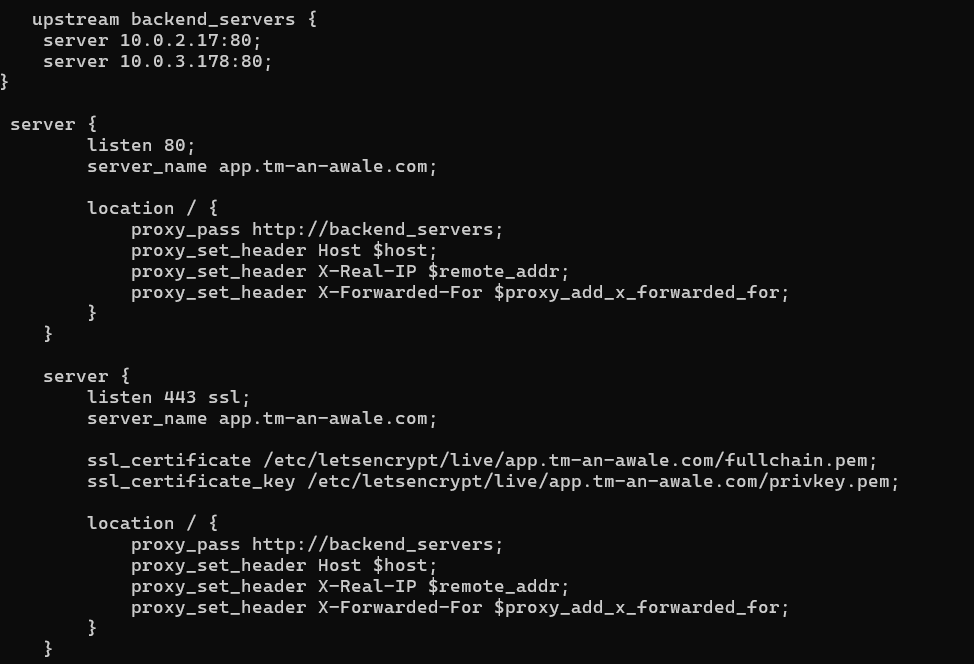
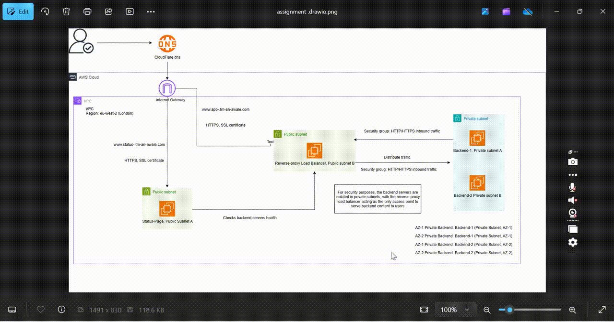

# High Availability Web Infrastructure with SSL and Reverse Proxy on AWS

## Project Overview
This project sets up a **high availability web infrastructure** with **SSL encryption**, utilizing a **reverse proxy server** as a load balancer to distribute traffic and isolate backend infrastructure for improved security.  

The entire system is deployed on **AWS** and demonstrates practical cloud networking, scalability, and security principles.  

---

## Architecture Diagram
A detailed architecture diagram was designed to blueprint the infrastructure, ensuring precision during deployment.  

<p align="center">
  
</p>

---

## Project Breakdown

### 1. Domain & DNS Setup
- Domain purchased on **Cloudflare**.  
- Subdomains configured with DNS A records pointing to the public IPs:  
  - **Reverse Proxy:** [app.tm-an-awale.com](https://app.tm-an-awale.com) – Handles traffic load balancing  
  - **Status Page:** [status.tm-an-awale.com](https://status.tm-an-awale.com) – Displays backend server health  

---

### 2. Infrastructure Setup

#### 2.1 VPC & Subnets
The VPC is divided into **4 subnets across two Availability Zones (AZs):**

| Subnet Type     | AZ   | Purpose        |
|-----------------|------|----------------|
| Public Subnet   | AZ-1 | Reverse Proxy  |
| Public Subnet   | AZ-2 | Status Page    |
| Private Subnet  | AZ-1 | Backend-1      |
| Private Subnet  | AZ-2 | Backend-2      |

> Backend servers remain isolated in private subnets, while only the reverse proxy and status page are publicly accessible.  

#### 2.2 Route Tables
- **Public Route Table:**  
  - Destination: `0.0.0.0/0` → Internet Gateway (IGW)  
  - Enables internet access for reverse proxy and status page.  

- **Private Route Table:**  
  - Routes VPC traffic internally only.  
  - No internet access, ensuring backend isolation.  

#### 2.3 Security Groups
Traffic control is enforced through separate security groups:

| Security Group        | Inbound Rules                                    | Outbound Rules                   |
|-----------------------|-------------------------------------------------|----------------------------------|
| Reverse Proxy SG      | HTTP/HTTPS from anywhere                        | To backend servers               |
| Status Page SG        | HTTP from anywhere                              | As required                      |
| Backend-1 SG          | HTTP only from Reverse Proxy SG                 | -                                |
| Backend-2 SG          | HTTP only from Reverse Proxy SG                 | -                                |

---

### 3. Instance Deployment
- **Backend-1 (Private, AZ-1):** Static webpage confirming server status  
- **Backend-1 Replica (Private, AZ-2):** High availability replica  
- **Backend-2 (Private, AZ-1):** Distinctive static webpage  
- **Backend-2 Replica (Private, AZ-2):** High availability replica  
- **Reverse Proxy (Public, AZ-1):** NGINX server load balancing requests between backends  

---

### 4. Reverse Proxy & Load Balancer Configuration

The **reverse proxy** ensures secure and distributed traffic management:  

- **NGINX Reverse Proxy:** Central entry point for all requests  
- **Load Balancing:** Round-robin strategy for even traffic distribution across backends, with failover handling  
- **SSL Encryption:** Configured via **Let’s Encrypt (Certbot)** to enforce HTTPS  

#### NGINX Configuration
<p align="center">
  
</p>

---

### 🎬 Application Demo GIF
The GIF below demonstrates the application in action right after NGINX is configured:  

<p align="center">
  
</p>

---

### Example Setup Commands
```bash
# Install and enable NGINX
sudo yum install nginx -y
sudo systemctl enable nginx
sudo systemctl start nginx

# Obtain and install SSL certificates for reverse proxy domain
sudo certbot --nginx -d app.tm-an-awale.com
